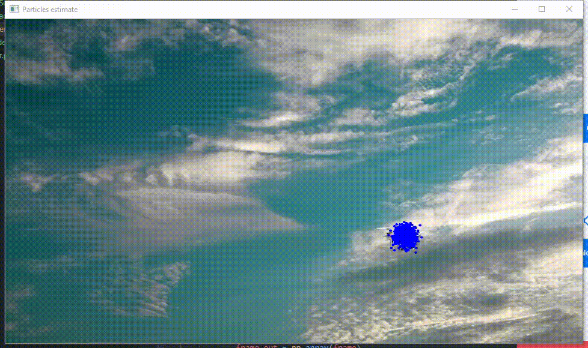

## Particle Filter For Object Tracking

- `model_package` package containing utility function for object detection model
- `motion_model.py` AR motion model to predict the motion of object of interest
- `Particle_filter.py` Implementation of particle filter using Auto-Regressor Model
- `Drone_tracker.py` Drive function for object detection and tracking using particle filter

### Motion Model:
**Input :** Current Position

**Output :** Parameter of equation of motion and movement noise

At each time step, this class takes current detected position (if any).
If number of past data acquired in greater than 5, it predicts the coefficients AR model.

[Note: This part doesnt need to be initialised by the use as it is the responsibality of the particle filter to initialise this class, user can tune the hyperparameter `past_record`specify the number of past records contribution toward extimation of parameters]

### Particle Filter:

**Initial Input :** Number of particles `no_particles`, (height, width) of image `world_size`, `past_record` for motion model

**Input :** Current Position (if detected)

**Output :** N particles, representing the possible position of the object of interest

**Working :**
`forward()` predicts the position of each particle at next time step
`weight()` calcualte the weight of each particle given detected position
`resample()` resample N particles given weight distribution.

### Detector Implementation:
For the detector to work, a folder named `saved_models` need to be created under the root directory `Particle_Filter` and the detector model  `detr_6.pth` needs to be stored inside it.

### Sample Output:

Output for: Simulation_normal.mp4